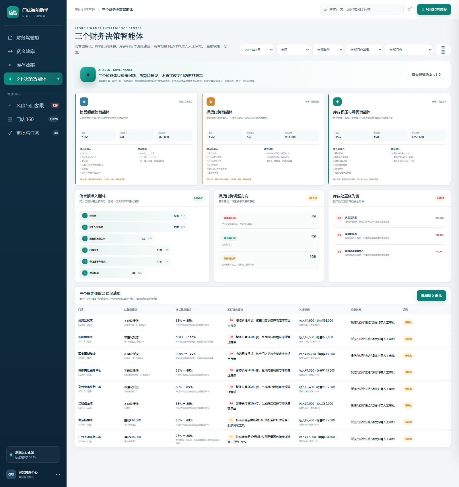
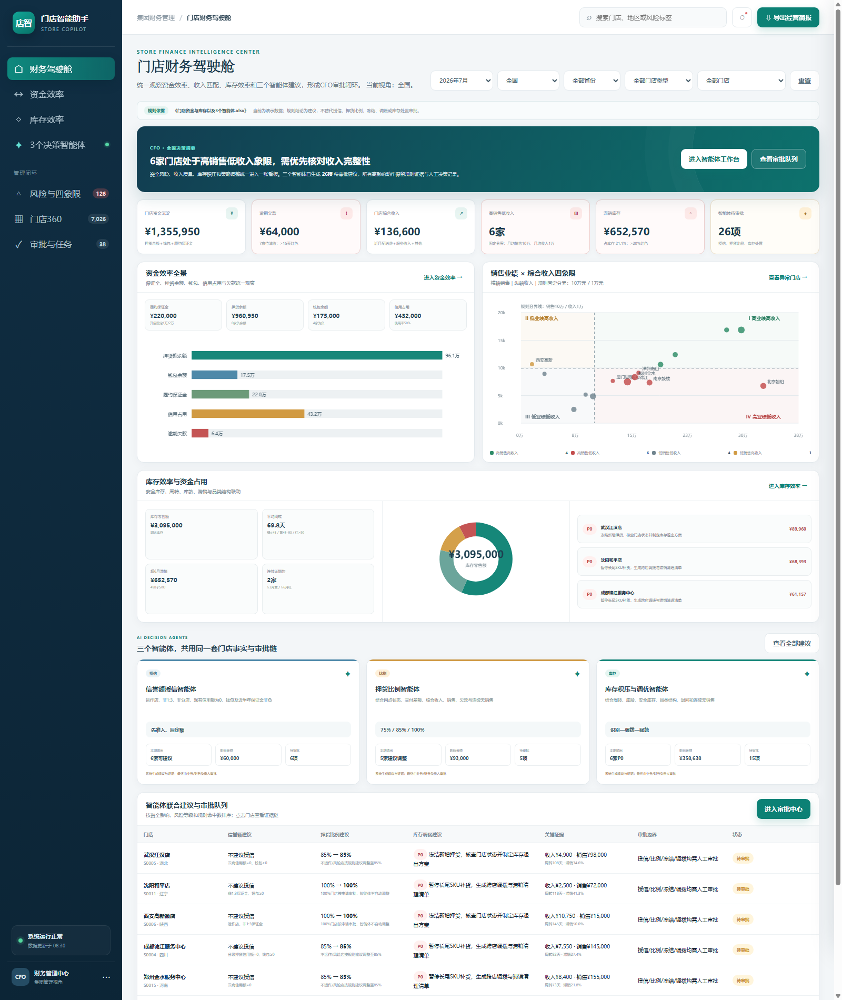
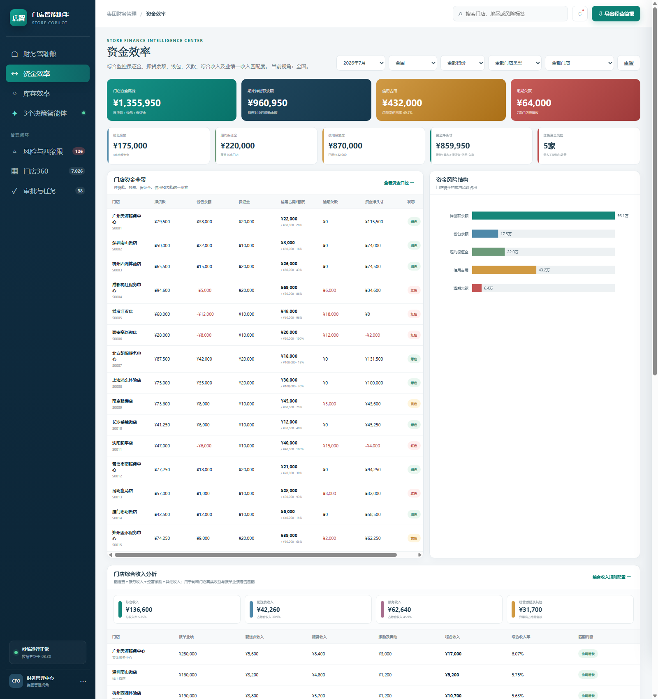

# Store Copilot — 门店财务决策智能体（产品 Demo）

> 企业级 AI 产品 Demo：从「大而全经营驾驶舱」收敛到「3 个可交付的决策智能体」的完整过程。
> 纯前端 HTML/JS + mock 数据，无任何后端依赖，打开 `index.html` 即可体验。

## 背景

某企业全国数千家门店的授信评估、押货比例调整、库存处置，依赖财务人工跨系统导数、手工汇总、经验判断：单次授信评估约 2 小时，口径不一，「僵尸店」风险识别滞后。本项目目标：把专家 20 余年的规则经验结构化为 AI 可执行的智能体体系，单次评估压缩到 5 分钟内。

## 三个版本，一个收敛故事

| 版本 | 目录 | 说明 |
|---|---|---|
| v0 最初诉求 | `v0-original-scope/` | 业务方最初想要的「CFO 经营驾驶舱」：经营驾驶舱 + 门店360 + 资金效率 + 库存效率 + 风险预警 + 智能分析中心 + 运营任务，大而全 |
| v0.5 规则验证 | `v0.5-rules-demo/` | 没有直接接大方案，先用一周搓出**纯业务规则验证 Demo**：把授信 / 押货规则做成可交互的规则引擎，让业务方在数据接口就绪前逐条验证规则逻辑 |
| v1 收敛后 | `v1-converged/` | 规则治理后收敛为 **3 个 P0 决策智能体**：信誉额授信 / 押货比例 / 库存积压与调优，外加审批闭环 |

**为什么砍掉大而全：**
1. 先验证后放大：接到大而全诉求后没有直接立项开发，而是先做纯规则验证 Demo（v0.5），让业务方逐条确认规则逻辑
2. 规则先行：把散落在多张 Excel 的业务规则重构为 85 字段「字段-规则-图例」体系，全表核对发现 **14 个规则冲突（2 个 P0）**——规则本身互相打架，直接开发等于把错误固化进系统
3. 收敛聚焦：与业务方逐条拍板后，将范围从 6+ 模块收敛为 3 个可闭环的 P0 智能体，每个都有明确的输入准入、建议输出和审批边界
4. 治理原则：智能体**只负责识别、测算和建议，不直接改变门店财务政策**，所有高影响动作进入人工审批（业务经理 / 财务经理 / 财务总监三级边界）

## 体验入口

- v1 收敛版（推荐）：`v1-converged/index.html`
- v0.5 规则验证 Demo：`v0.5-rules-demo/index.html`
- v0 最初版：`v0-original-scope/index.html`

## 截图

## 技术说明

纯 HTML/CSS/JS 单页应用，mock 数据内置；由产品经理使用 AI Coding（Claude Code / Codex）直接构建，用于在数据接口就绪前让业务方验证规则逻辑与交互。
